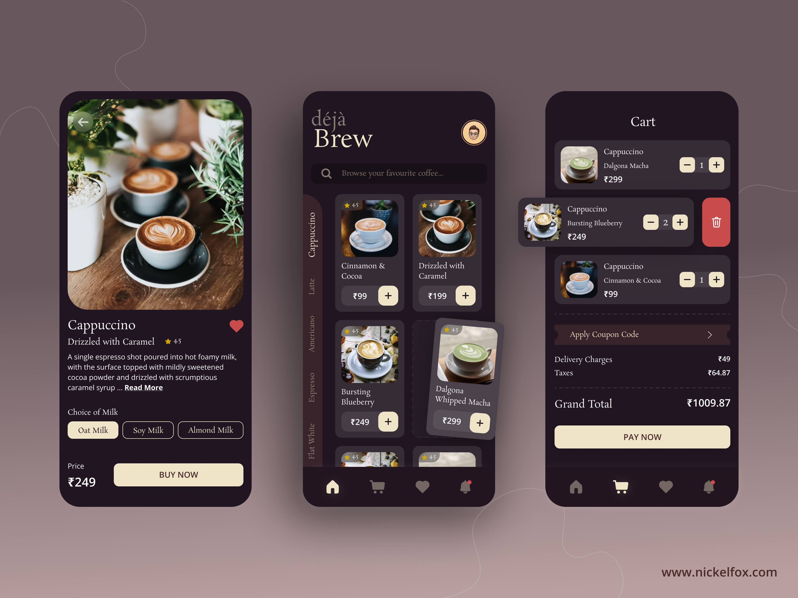

# Coffee Delivery

<p align="center">
  <a href="#-layout">Layout</a> •
  <a href="#-technologies">Technologies</a> •
  <a href="#-getting-started">Getting started</a> •
  <a href="#-license">License</a>
</p>

<p align="center">
  
</p>

## 🔖 Layout

The author of this layout is [Nickelfox Design](https://www.figma.com/@Nickelfox). You can view the project in this [link](https://www.figma.com/community/file/1050295107596166499).

## 🚀 Technologies

- [Expo](https://expo.io/)
- [ReactJS](https://reactjs.org/)
- [React Native](https://reactnative.dev/)
- [React Navigation](https://reactnavigation.org/)
- [React Native Gesture Handler](https://docs.swmansion.com/react-native-gesture-handler/)
- [TypeScript](https://www.typescriptlang.org/)
- [AsyncStorage](https://react-native-async-storage.github.io/async-storage/)
- [Zustand](https://github.com/pmndrs/zustand)

## 💻 Getting started

### Requirements

- [Node.js](https://nodejs.org/en/)
- [Yarn](https://classic.yarnpkg.com/) or [npm](https://www.npmjs.com/package/npm)

**Clone the project and access the folder**

```bash
git clone https://github.com/EliasGcf/coffee-delivery-app.git && cd coffee-delivery-app
```

**Follow the steps below**

```bash
# Install the dependencies
$ yarn

# Run the JSON Server
$ yarn json:sever

# If you are going to emulate with android, run this command
$ yarn android

# If you are going to emulate with ios, run this command
$ yarn ios
```

## 📝 License

This project is licensed under the MIT License - see the [LICENSE](LICENSE) file for details.

---

<p align="center">
  Made with 💜&nbsp; by <a href="https://www.linkedin.com/in/eliasgcf/">Elias Gabriel</a>
</p>
